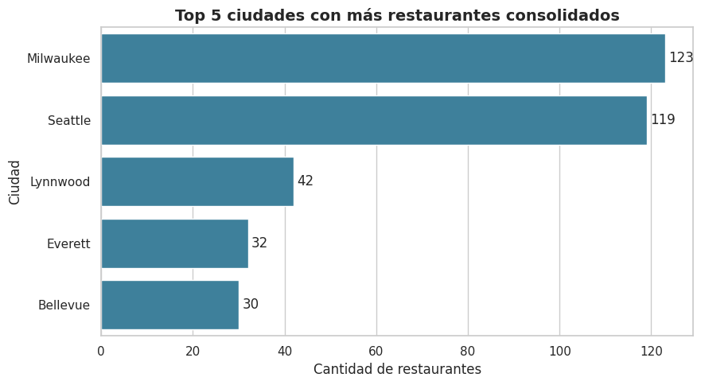
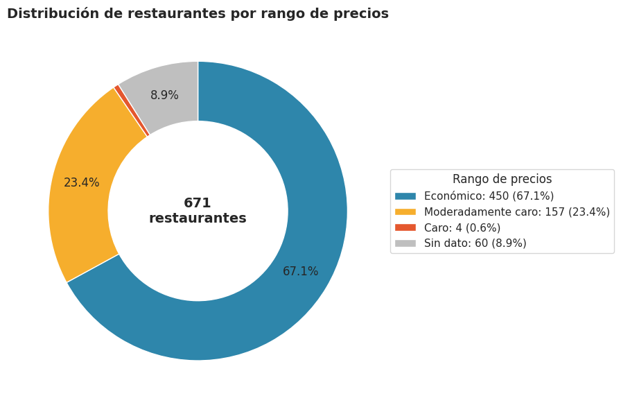
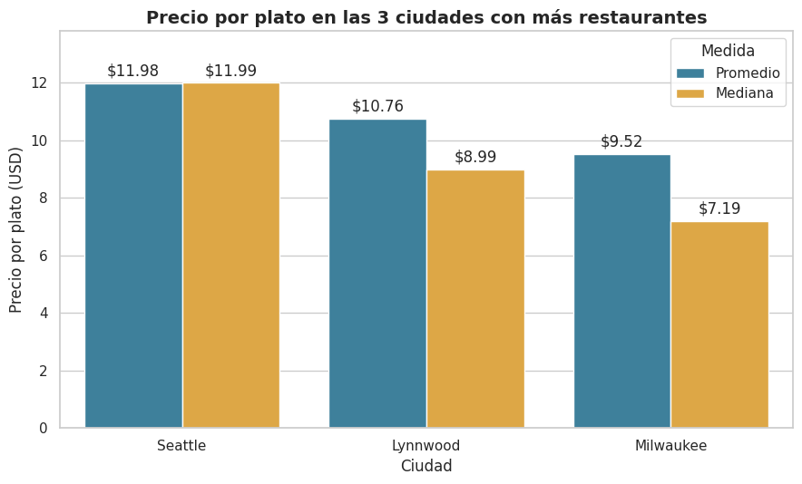
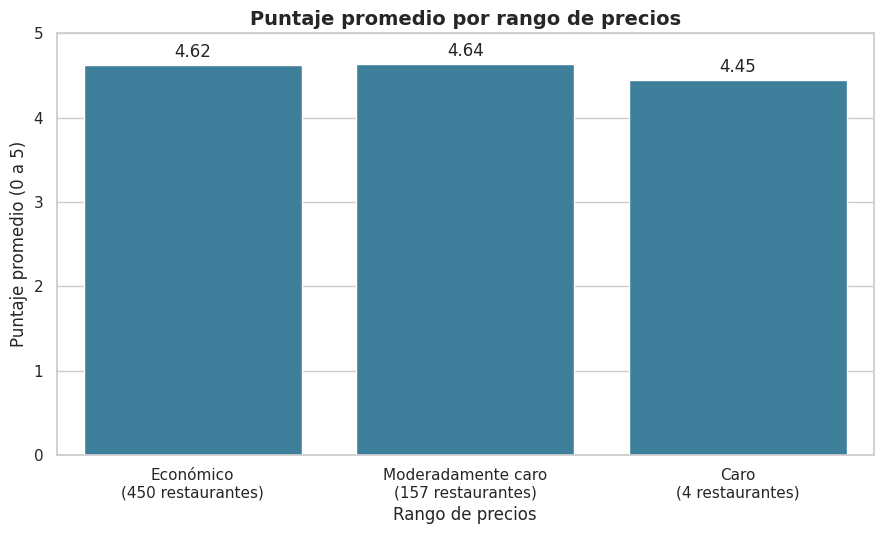

# 🍔 Pipeline ETL e Inteligencia de Mercado: Food Delivery

Proyecto final del curso **Python for Data Analyst** de la especialización en Data Analyst. Construí un pipeline ETL completo con Pandas y SQLite, y respondí cuatro preguntas de negocio con SQL y gráficos.

## 📑 Índice

- [Contexto de negocio](#-contexto-de-negocio)
- [Hallazgos clave](#-hallazgos-clave)
- [Recomendaciones para el CEO](#-recomendaciones-para-el-ceo)
- [Problemas encontrados en los datos y cómo los resolví](#-problemas-encontrados-en-los-datos-y-cómo-los-resolví)
- [Arquitectura del pipeline](#-arquitectura-del-pipeline)
- [Limitaciones](#-limitaciones)
- [Tecnologías](#-tecnologías)
- [Contenido del repositorio](#-contenido-del-repositorio)
- [Autor](#-autor)

## 🎯 Contexto de negocio

Una startup de food delivery quiere expandirse en Estados Unidos. Antes de lanzar la app, el directorio necesita saber cómo operan los competidores: en qué ciudades hay más restaurantes, cómo se distribuyen los precios y si un precio más alto se traduce en mejor calidad.

## 📊 Hallazgos clave

### 1. Geografía: Milwaukee y Seattle lideran dentro de la muestra

Milwaukee (123 restaurantes) y Seattle (119) lideran con amplia ventaja y reúnen el 36 % de los 669 restaurantes con ciudad. Lynnwood, Everett y Bellevue, que completan el top 5, también están en Washington.

**Ojo con el alcance:** La muestra está concentrada en pocos estados (466 restaurantes en Washington, 177 en Wisconsin, 25 en Illinois y 1 en Oregón), así que este ranking refleja las zonas que cubren los datos y no necesariamente todo el mercado de Estados Unidos.



<details>
<summary>Ver el query SQL</summary>

```sql
SELECT
    ciudad,
    COUNT(DISTINCT id) AS restaurantes,  -- restaurantes distintos, no platos
    COUNT(*)           AS platos         -- solo para comparar con COUNT(*)
FROM master_food_data
WHERE ciudad IS NOT NULL
GROUP BY ciudad
ORDER BY restaurantes DESC, ciudad ASC
LIMIT 5
```

</details>

### 2. Precios: el mercado no es caro

El 67 % de los restaurantes es Económico y el 23 % Moderadamente caro. Solo 4 son Caros y ninguno es Muy caro. 60 restaurantes (9 %) no tienen rango de precio.



<details>
<summary>Ver el query SQL</summary>

```sql
SELECT
    COALESCE(price_range, 'Sin dato') AS rango_de_precios,  -- los nulos aparecen como "Sin dato"
    COUNT(DISTINCT id) AS restaurantes,
    ROUND(100.0 * COUNT(DISTINCT id)
          / (SELECT COUNT(DISTINCT id) FROM master_food_data), 1) AS porcentaje
FROM master_food_data
GROUP BY rango_de_precios
ORDER BY CASE rango_de_precios                              -- orden lógico, no alfabético
    WHEN 'Económico' THEN 1
    WHEN 'Moderadamente caro' THEN 2
    WHEN 'Caro' THEN 3
    WHEN 'Muy caro' THEN 4
    ELSE 5 END
```

</details>

### 3. Menú por ciudad: Seattle es la más cara para comer

El plato cuesta en promedio $11.98 en Seattle, $10.76 en Lynnwood y $9.52 en Milwaukee. La mediana confirma el mismo orden.



<details>
<summary>Ver el query SQL</summary>

```sql
WITH top_ciudades AS (                        -- las 3 ciudades con más restaurantes
    SELECT ciudad
    FROM master_food_data
    WHERE ciudad IS NOT NULL
    GROUP BY ciudad
    ORDER BY COUNT(DISTINCT id) DESC, ciudad ASC
    LIMIT 3
)
SELECT
    ciudad,
    ROUND(AVG(price), 2) AS precio_promedio,
    COUNT(*)             AS platos,
    MAX(price)           AS precio_maximo
FROM master_food_data
WHERE ciudad IN (SELECT ciudad FROM top_ciudades)
GROUP BY ciudad
ORDER BY precio_promedio DESC
```

La mediana la calculé con pandas, porque SQLite no trae una función de mediana.

</details>

### 4. Precio y calidad: más caro no significa mejor

Económico (4.62) y Moderadamente caro (4.64) tienen casi el mismo puntaje. Caro (4.45) se basa en solo 4 restaurantes, muy pocos para sacar una tendencia.



<details>
<summary>Ver el query SQL</summary>

```sql
WITH restaurantes AS (                    -- un registro por restaurante, no por plato
    SELECT DISTINCT id, price_range, score
    FROM master_food_data
    WHERE price_range IS NOT NULL
)
SELECT
    price_range          AS rango_de_precios,
    COUNT(*)             AS restaurantes,
    ROUND(AVG(score), 2) AS score_promedio
FROM restaurantes
GROUP BY price_range
ORDER BY CASE price_range
    WHEN 'Económico' THEN 1
    WHEN 'Moderadamente caro' THEN 2
    WHEN 'Caro' THEN 3
    WHEN 'Muy caro' THEN 4 END
```

</details>

## 💡 Recomendaciones para el CEO

- **Empezar por Seattle y Milwaukee como primera validación.** Son las ciudades con más restaurantes en la muestra (119 y 123), pero la muestra cubre sobre todo Washington y Wisconsin, así que conviene confirmarlo con datos de más estados antes de decidir.
- **Posicionarse en precios Económico y Moderado.** El 90 % de los restaurantes de la muestra está en esos dos rangos, así que ahí está la competencia.
- **Ajustar el precio por ciudad.** El plato en Seattle cuesta en promedio $2.46 más que en Milwaukee ($11.98 frente a $9.52).
- **No asumir que subir el precio mejora la calidad.** En esta muestra el puntaje no sube con el rango de precio (Económico 4.62, Moderadamente caro 4.64). Como casi todos los restaurantes tienen puntajes altos, conviene probarlo con una muestra más variada.
- **Confirmar antes de invertir.** Estos resultados salen de 671 restaurantes, el 96 % en Washington y Wisconsin (ver Limitaciones).

## 🔍 Problemas encontrados en los datos y cómo los resolví

| Problema | Cómo lo detecté | Cómo lo resolví |
|---|---|---|
| 28,167 restaurantes (44 %) sin puntaje | Data profiling (nulos por columna) | Los eliminé con el filtro de calidad |
| Un `price_range` con 17 símbolos `$` | `value_counts` | No lo mapeé: quedó como nulo |
| 1,861 direcciones (3 %) con comas de más, por ejemplo `Suite 4` | Conteo de comas por dirección | Corté desde la derecha con `rsplit`: las últimas tres partes son ciudad, estado y código postal |
| El menú viene en 10 archivos CSV | Exploración de la carpeta | Los leí con `glob`, verifiqué que tuvieran las mismas columnas y los uní con `concat` |
| `price` es texto (`15.99 USD`) | `.dtypes` | Quité " USD" y lo convertí a `float` |
| 37,551 platos con precio 0 y 2 con precio negativo | `describe()` del precio | Filtré con `price > 0` |
| `category` y `name` existen en ambas tablas | Preparación del cruce | Usé `suffixes` en el merge |
| Cada fila es un plato, no un restaurante | Diseño de `df_master` | Conté con `COUNT(DISTINCT id)`; para el puntaje me quedé primero con un registro por restaurante |
| Los menús solo cubren los `restaurant_id` del 1 al 10,082 | El cruce dejó 671 de 8,702 restaurantes; luego conté los restaurantes por estado | Lo documenté como limitación: el 96 % de la muestra está en Washington y Wisconsin. Trabajé con esa muestra |

## 🧱 Arquitectura del pipeline

| Fase | Qué hice |
|---|---|
| **Extract** | Lectura de `restaurants.csv` y de los 10 archivos de menús, y data profiling (dimensiones, tipos y nulos) |
| **Transform** | Mapeo de precios, separación de la dirección en calle, ciudad y estado, filtros de calidad, conversión del precio a número y cruce de tablas |
| **Load** | Base SQLite `delivery_insights.db` con la tabla `master_food_data`, creada con SQLAlchemy |
| **BI** | Cuatro consultas SQL leídas con `pd.read_sql` y un gráfico por pregunta, cada uno con su conclusión |

**Datos de partida:** `restaurants.csv` (63,469 restaurantes) y `restaurant-menus` (836,350 platos en 10 archivos CSV), entregados por el curso y no incluidos en este repositorio.

**Cómo se redujeron los datos:** primero filtré los restaurantes con más de 100 calificaciones y después hice el cruce, con `validate="one_to_many"`, para que el merge use menos memoria. La base se crea en el disco local de Databricks (`/tmp`) y se copia al Volume al final, porque SQLite necesita escribir y bloquear el archivo.

| Paso | Restaurantes | Platos |
|---|---|---|
| Datos originales | 63,469 | 836,350 |
| Con puntaje válido | 35,302 | n/a |
| Precio mayor a 0 | n/a | 798,797 |
| Más de 100 calificaciones | 8,702 | n/a |
| Tabla final después del cruce | 671 | 63,221 |

## ⚠️ Limitaciones

Los resultados describen una muestra de **671 restaurantes**, no todo el mercado de Estados Unidos:

- **Cobertura de los menús:** los menús entregados cubren solo los `restaurant_id` del 1 al 10,082, por eso el cruce dejó 671 de los 8,702 restaurantes con más de 100 calificaciones.
- **Cobertura geográfica:** el 96 % de la muestra está en Washington (466) y Wisconsin (177); el resto está en Illinois (25), Oregón (1) y 2 sin dato de estado.
- **Puntajes altos:** son restaurantes con más de 100 calificaciones y puntajes entre 3.2 y 5.0, así que hay poca variación de calidad para comparar.

Los hallazgos son una primera señal para confirmar con datos más completos.

## 🛠️ Tecnologías

Python, Pandas, SQLAlchemy, SQLite, SQL, Matplotlib, Seaborn y Databricks (Free Edition).

## 📁 Contenido del repositorio

- `proyecto_etl_delivery.ipynb`: cuaderno con todo el desarrollo.
- `screenshots/`: capturas de los 4 gráficos del análisis.
- `README.md`: este documento.

## 👤 Autor

Sebastian Aldana Pachas